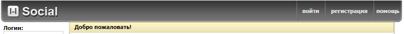
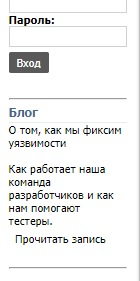

\

\
Добро пожаловать на репозиторий l-lacker Social (это социальная сеть, основанная на исходниках OpenVK Classic)
Она созданна с целью быстрой связи с друзьями, одноклассницами и однокурсницами, а также ностальгии о старом ВК.\
Уже написано **5,000+** строчек кода и зарегистрированно больше 48 пользователей.

**Внимание:** OpenVKCi признан ***устаревшим*** и будет заменён в пользу OpenVK 4 (VriExt), тогда OpenVKCi перестанет получать новые обновления, а вскоре и патчи безопасности (см. [wiki](https://github.com/l-lsoc/social/wiki/%D0%94%D0%B0%D1%82%D1%8B-%D0%BE%D0%BA%D0%BE%D0%BD%D1%87%D0%B0%D0%BD%D0%B8%D1%8F-%D0%BF%D0%BE%D0%B4%D0%B4%D0%B5%D1%80%D0%B6%D0%BA%D0%B8 "Даты окончания поддержки и информация по миграции")).
